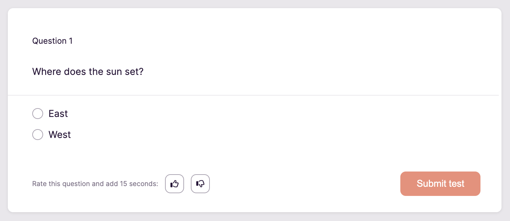

# Toggl Hire Backend Developer Homework

The goal of this assignment is to see how familiar you are with developing APIs in Go. We tried to pick a task that is similar to what you would do at Toggl Hire, while keeping it minimal so you can finish it in a short time.

Create a new repository on GitHub. You can [use this one as a template](https://github.com/togglhire/backend-homework/generate). Commit your solution to your repository and send us a link to it. If you prefer having the repository private, please add [miscer](https://github.com/miscer) as a collaborator, so we can review it.

## Description

The API you will implement lets experts from various fields to submit questions to our [test library](https://support.hire.toggl.com/en/articles/4358773-toggl-hire-test-library).

### Questions

Questions have a simple structure. Each question has a body that defines what the candidate for a job position is supposed to answer. Then there are two or more options that the candidate can choose from. Each option has a body as well and a boolean attribute that defines whether the option is correct. At least one of the options is correct. Below is a JSON representation of a sample question.

```json
{
  "body": "Where does the sun set?",
  "options": [
    {
      "body": "East",
      "correct": false
    },
    {
      "body": "West",
      "correct": true
    }
  ]
}
```

To better illustrate, below is how this question would be rendered in our UI. Note that you do not need to produce any UIs.



### Listing questions

The first endpoint should return a list of all questions in the database. The order of questions and options inside questions should be stable, i.e. not change on every request. The whole question, including the options is returned.

For example, the response could look like this:

```json5
[
  {
    "body": "Where does the sun set?",
    "options": [
      {
        "body": "East",
        "correct": false
      },
      // other options...
    ]
  },
  {
    "body": "What is the answer to the ultimate question of life, the universe, and everything?",
    // rest of the question...
  },
  {
    "body": "But what is the ultimate question?",
    // rest of the question...
  }
]
```

### Creating a new question

The second endpoint creates a new question in the database and then returns it in the response. The request body contains the question in JSON. The order of options in the request body should be stored as well and the same order should be returned by the API from all requests.

For example, for the request containing the following JSON, the server would return the question show above, in the Questions section.

```json
{
  "body": "Where does the sun set?",
  "options": [
    {
      "body": "East",
      "correct": false
    },
    {
      "body": "West",
      "correct": true
    }
  ]
}
```

### Updating a question

The third endpoint updates an existing question and returns the updated question in the response. The whole question is included in the request body, including all attributes. The question to be updated should be identified in the request URL. The order of options in the request body should be stored the same way as explained in the create endpoint above. 

For example, to change the question from before to ask about sunrise, we would send the following JSON.

```json
{
  "body": "Where does the sun rise?",
  "options": [
    {
      "body": "East",
      "correct": true
    },
    {
      "body": "West",
      "correct": false
    }
  ]
}
```

## Basic requirements

Your solution should meet all these requirements.

- [ ] Endpoint that returns a list of all questions
- [ ] Endpoint that allows to add a new question
- [ ] Endpoint that allows to update an existing question
- [ ] Question data is stored in a SQLite database with a **normalised** schema
- [ ] The order of questions and options is stable, not random
- [ ] The `PORT` environment variable is used as the port number for the server, defaulting to 3000

## Bonus requirements

These requirements are not required, but feel free to complete some of them if they seem interesting, or to come up with your own :)

- [ ] Endpoint that allows to delete existing questions
- [ ] Pagination for the list endpoint

  This can be in the form of basic offset pagination, or seek pagination. The difference is explained in [this post](https://web.archive.org/web/20210205081113/https://taylorbrazelton.com/posts/2019/03/offset-vs-seek-pagination/).

- [ ] JWT authentication mechanism
  
  Clients are required to send a JSON Web Token that identifies the user in some way. The API returns only questions that belong to the authenticated user. Endpoint for generating tokens is not needed, we can generate them through [jwt.io](https://jwt.io/).

- [ ] Use GraphQL instead of REST to implement the API

  Define a schema for the API that covers the basic requirements and implement all queries and resolvers. You do not need to implement the REST API if you choose to do this.

## Additional notes

You should use identifiers where necessary, and expose those identifiers through the API where necessary to allow clients to manage questions in the database. You are free to add any attributes to questions and options to satisfy the requirements.

You can use any libraries and frameworks, but all dependencies should be defined in the `go.mod` file. The code should be formatted with `go fmt` or similar. While the app is quite simple, your solution should be in a state where you consider it ready to be deployed to production (Heroku for example).

SQLite was chosen to make it easier to test your solution, as it does not require a complicated setup. Please include a way for us to initialise the database schema. This can be in the form of a SQL file, or the app can set up the schema automatically when a new database is created.

